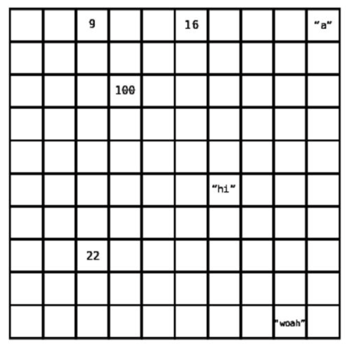
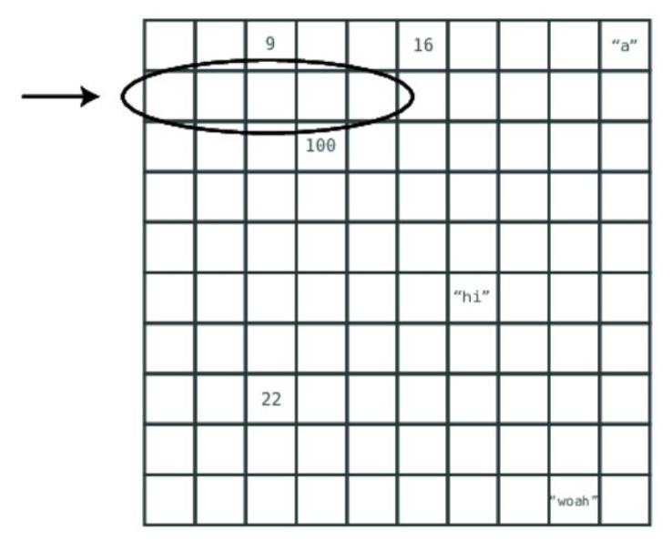
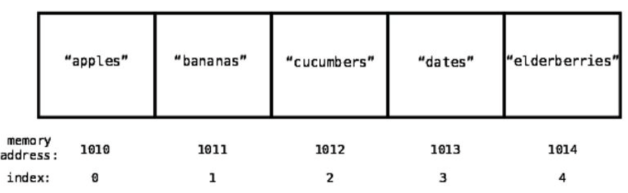

# What is an array data structure? 

An ordered collection/list of data elements (elements can be string, number, boolean, or objects). 

The index of an array is the number that identifies where a piece of data lives inside the array (In most programming languages, index starts at 0).

Most data structures are used in four basic ways, which are refered to as operations
- Read: Reading looks up from a particular spot within the data structure. With an array, this means looking up a value at a particular index
- Search: Searching looks for a particular value within a data structure. With an array, this means looking to see if particular value exists within the array, if so, which index is it at. 
- Insert: Insertion is adding another value to the data structure. With an array, this means adding a new value to an additional slot within the array
- Delete: Deletion is removing a value from the data structure. With an array, this means removing one of the values from the array.

## Reading

Reading from an array takes just one step. Because the computer has the ability to jump to any particular index in the array and peek inside.

A computer's memory can be viewed as a giant collection of cells. 

When a program declares an array, it allocates a contiguous set of empty cells for use in the program. So, if you were creating an array meant to hold five elements, your computer would find any group of five empty cells in a row and designate it to serve as the array. 

Every cell in a computer's memory has a specific address. It's sort of like a street address, except it's represented with a simple number. Each cell's memory address is one number greater than the previous cell. 

When the computer reads a value at a particular index of an array, it can jump straight to that index in one step: 
1. A computer can jump to any memory address in one step
2. Recorded in each array is the memory address which it begins at. So the computer has this starting address readily
3. Every array begins at index 0

4. Our array begins with index 0 at memory address 1010
5. Index 3 will be exactly three slots past index 0
6. So to find index 3, we'd go to memory address 1013, since 1010 + 3 is 1013 

Reading from an array is, therefore, a very efficient operation since it takes just one step. An operations with just one step is naturally the fastest type of operation

## Searching
