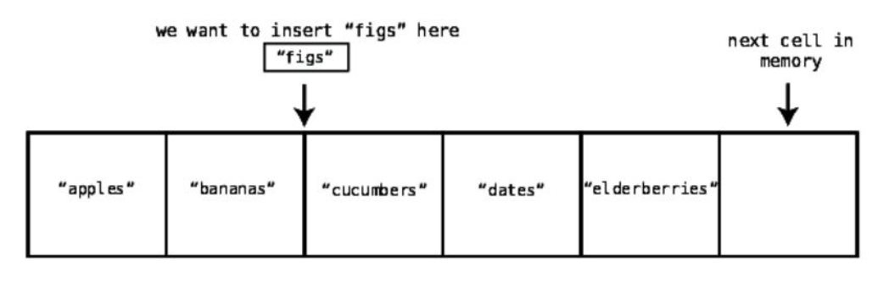

# What is an array data structure? 

An ordered collection/list of data elements (elements can be string, number, boolean, or objects). 

The index of an array is the number that identifies where a piece of data lives inside the array (In most programming languages, index starts at 0).

Most data structures are used in four basic ways, which are refered to as operations
- Read: Reading looks up from a particular spot within the data structure. With an array, this means looking up a value at a particular index
- Search: Searching looks for a particular value within a data structure. With an array, this means looking to see if particular value exists within the array, if so, which index is it at. 
- Insert: Insertion is adding another value to the data structure. With an array, this means adding a new value to an additional slot within the array
- Delete: Deletion is removing a value from the data structure. With an array, this means removing one of the values from the array.

## Reading

Reading from an array takes just one step. Because the computer has the ability to jump to any particular index in the array and peek inside.

A computer's memory can be viewed as a giant collection of cells. 

When a program declares an array, it allocates a contiguous set of empty cells for use in the program. So, if you were creating an array meant to hold five elements, your computer would find any group of five empty cells in a row and designate it to serve as the array. 

Every cell in a computer's memory has a specific address. It's sort of like a street address, except it's represented with a simple number. Each cell's memory address is one number greater than the previous cell. 

When the computer reads a value at a particular index of an array, it can jump straight to that index in one step: 
1. A computer can jump to any memory address in one step
2. Recorded in each array is the memory address which it begins at. So the computer has this starting address readily
3. Every array begins at index 0

4. Our array begins with index 0 at memory address 1010
5. Index 3 will be exactly three slots past index 0
6. So to find index 3, we'd go to memory address 1013, since 1010 + 3 is 1013 

Reading from an array is, therefore, a very efficient operation since it takes just one step. An operations with just one step is naturally the fastest type of operation

## Searching

Searching an array is looking to see whether a particular value exists within an array and if so, which index it's located at.

To search for a value within an array, the computer starts at index 0, checks the value, and if it doesn't find what it's looking for, moves on to the next index. This continues until it finds the value it's seeking.

To find "dates", first, the computer checks index 0:

Since the value at index 0 is "apples" and not "dates", the computer moves on to the next index: 

Since index 1 doesn't contain "dates", the computer moves on and repeats until it finds "dates"

For N cells in an array, linear search will take a maximum of N steps. 

## Insertion

The efficiency of inserting a new piece of data inside an array depends on where inside the array we want to insert it.

To insert "figs" at the end of the array, since the computer knows how many elements are in the array, it can calculate which memory address it needs to add the new element to, and do so in one step.

Inserting a new piece of data at the beginning or the middle of array, requires shifting many pieces of data to make room for what is being inserted. 

To do this, "cucumbers", "dates", and "elderberries" on the right will need to make room for "figs". This would take four steps. Three of the steps were shifting data to the right, while one step was the actual insertion of the value.

The worst-case scenario for insertion into an array can take up to N + 1 steps for an array containing N elements. This is because the worst-case is inserting a value into the beginning of the array in which there are N shifts and one insertion.

## Deletion

Deletion from an array is the process of eliminating the value at a particular index. 

While the deletion of "cucumbers' takes just one step, an array is not allowed to have gaps in the middle of it, so to resolve this issue, "dates" and "elderberries" needs to shift back to the left.

Like insertion, the worst-case scenario of deleting an element is deleting the very first element of the array. This is because index 0 would be empty, and we'd have to shift all the remaiing elements to the left to fill the gap. For an array containing N elements, the maximum number of steps that deletion would take is N steps. 