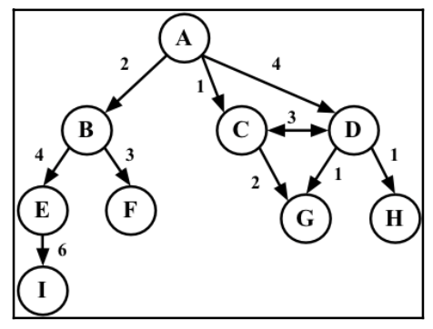

# What is a Graph data structure? 
A graph is an abstract model of a network structure. A graph is set of nodes (or vertices) connected by edges. Learning about graphs is important because any binary relationship can be represented by a graph. 

Any social network, such as Facebook, Twitter, Google can be represented by a graph. 

We can also use graphs to represent roads, flights, and communications. 

A graph G = (V, E) is composed of:
- V: A set of vertices
- E: A set of edges connecting the vertices in V

Vertices connected by an edge are called adjacent vertices. For example. A and B are adjacent, A and D are adjacent, A and C are adjacent, and A and E are not adjacent.

A degree of a vertex consists of the number of adjacent vertices. For example, A is connected to three other vertices, therefore A has degree of 3; E is connected to two other vertices, therefore E has degree of 2. 

A path is a sequence of consecutive vertices that are adjacent. Using the graph above, we have the paths "A, B, E, I" and "A, C, D, G" among others. 

A simple path does not contain repeated vertices. As an example, we have the path A, D, G. A cycle is a simple path, except for the last vertex, which is the same as the first vertex: A, D, C, A (back to A). 

A graph is acyclic if it does not have cycles. A graph is connected if there is a path between every pair of vertices. 

## Directed and undirected graphs
Graphs can be undirected (where edges do not have a direction) or directed (digraph), where edges have a direction

A graph is strongly connected if there is a path in both directions between every pair of vertices. For example, C and D are strongly connected, while A and B are not strongly connected. 

Graphs can also be unweighted or weighted (in which the edges have weights)

## Representing a graph
There are a few ways in which we can represent graphs when it comes to data structures. There is no correct way of representing a graph among the existing possibilities. It depends on type of problem to resolve and the type of graph as well. 

### The adjacency matrix
The most common implementation is the adjacency matrix. Each node is associated with an integer, which is the array index. We will represent the connectivity between vertices using a two-dimensional array, as `array[i][j] === 1` if there is an edge from the node with index `i` to the node with index `j` or as `array[i][j] === 0` 

Graphs that are not strongly connected (sparse graphs) will be represented by a matrix with many zero entries in the adjacency matrix. This means we would waste space in the computer memory to represent edges that do not exist. For example, if we need to find the adjacent vertices of a given vertex, we will have to iterate through the whole row even if this vertex has only one adjacent vertex. Another reason this might not be a good representation is that the number of vertices in the graph may change, and two dimenstional array is inflexible. 

### The adjacency list
Dynamic data structure could also be represented as graphs as well - called an adjacency list. This consists of a list of adjacent vertices for every vertex of the graph. There are a few different ways it can be represented. To represent the list of adjacent vertices, an array, a linked list, or even hash map or dictionary can be used. 

